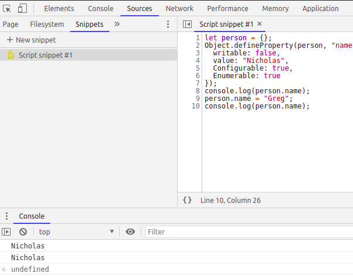
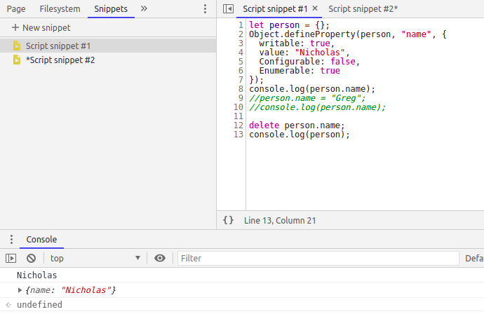
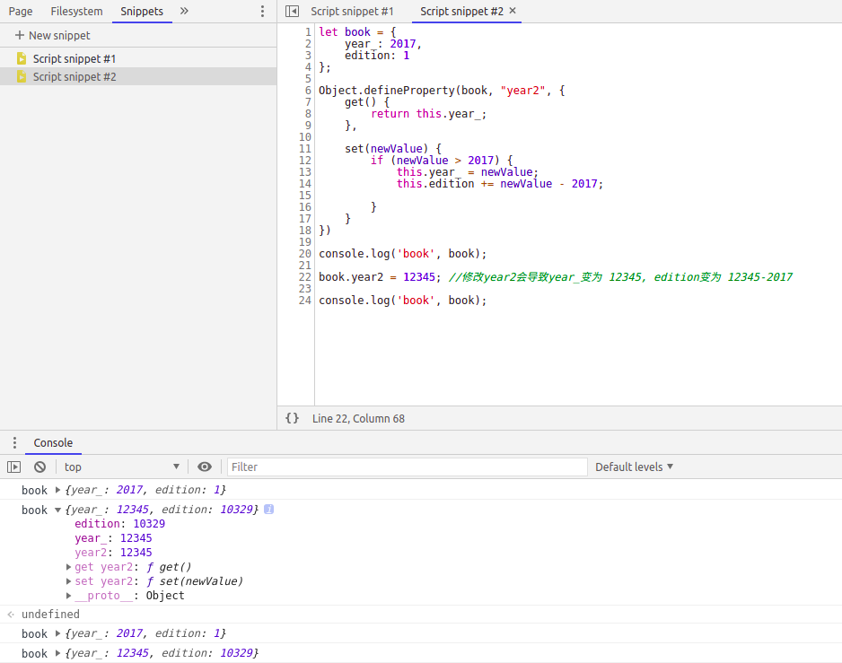
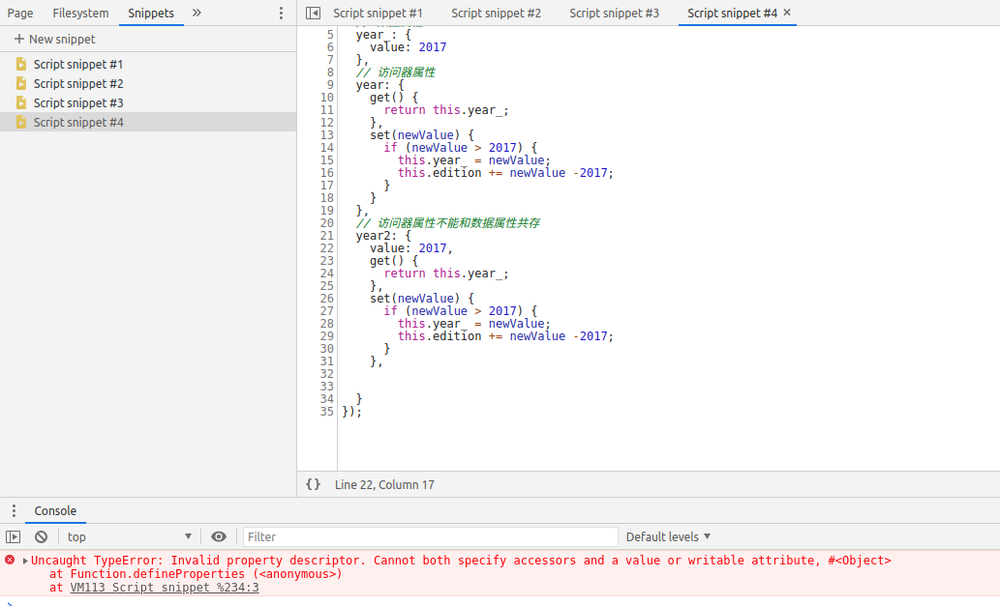
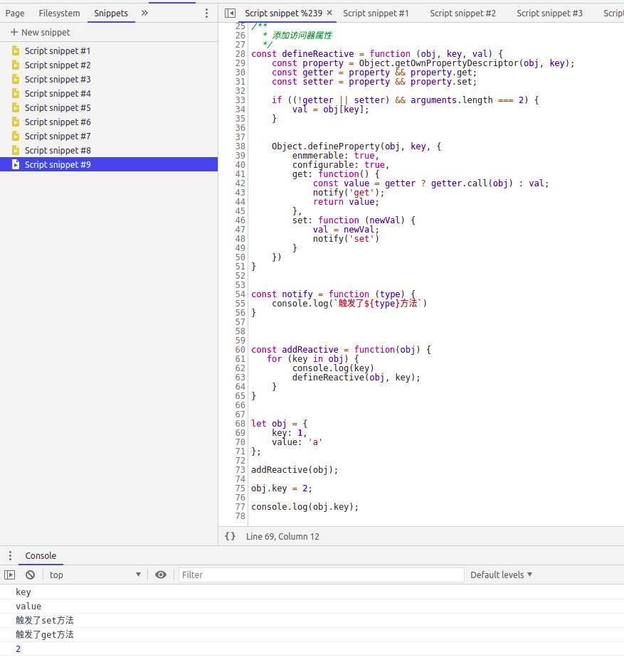
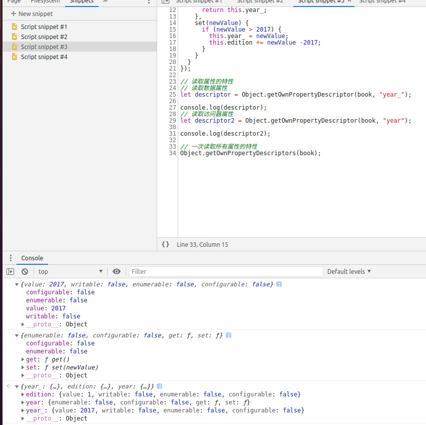

# 第八章 对象、类与面向对象编程

## 8.1 理解对象
### 8.1.1 属性的类型
#### 数据属性
- [[Configurable]]: 
  直接定义对象时，默认为true.
  
  **如果是使用Object.defineProperty，默认是false.**
  
  - 属性是否可删除 delete object.pro
  - 是否可以修改某些特性
  - 是否可以可以改为访问器属性
  - 定义为configurable = false后，再也无法改回true.所以虽然可以对同一个属性多次调用Object.defineProperty(),但在把configurable设置为false之后，就无效了.
  
- [[Enumerable]]:
  直接定义对象时，默认为true
  
  如果是使用Object.defineProperty，默认是false.
  
  - 是否可以通过for..in 遍历
  
- [[Writable]]: 
  直接定义对象时，默认为true
  
  **如果是使用Object.defineProperty，默认是false.**
  
   - 是否可以修改属性的值 object.pro = 'new'
  
- [[value]]:
  **不论直接还是defineProperty定义对象，默认都为undefined.**
  
  - 属性实际的值
  
##### writable



##### configurable



#### 访问器属性

[[Configurable]]: 表示属性是否可以通过delete删除并重新定义，是否可以修改他的特性,以及是否可以把它改为数据属性。

[[Enumerable]]: 表示属性是否可以通过for-in 循环返回.默认情况下，所有直接定义在对象上的属性的这个特性都是true.

[[Get]]:获取函数，**在读取属性时调用**.默认值为undefined

[[Set]]: 设置函数，**在写入属性时调用**。默认值为undefined




**TIPS: 不能同时定义访问器属性和数据属性**

如下图所示，同时定义访问器属性和数据属性会报错

```
Uncaught TypeError: Invalid property descriptor. Cannot both specify accessors and a value or writable attribute, #<Object>
    at Function.defineProperties (<anonymous>)
    at VM113 Script snippet %234:3
```



**关于访问器属性，比较经典的用法应该是是vue中采用的订阅发布模式.**

```javascript
// vue/src/core/observer/index.js

Object.defineProperty(obj, key, {
    enumerable: true,
    configurable: true,
    get: function reactiveGetter () {
      const value = getter ? getter.call(obj) : val
      if (Dep.target) {
        dep.depend()
        if (childOb) {
          childOb.dep.depend()
          if (Array.isArray(value)) {
            dependArray(value)
          }
        }
      }
      return value
    },
    set: function reactiveSetter (newVal) {
      const value = getter ? getter.call(obj) : val
      /* eslint-disable no-self-compare */
      if (newVal === value || (newVal !== newVal && value !== value)) {
        return
      }
      /* eslint-enable no-self-compare */
      if (process.env.NODE_ENV !== 'production' && customSetter) {
        customSetter()
      }
      // #7981: for accessor properties without setter
      if (getter && !setter) return
      if (setter) {
        setter.call(obj, newVal)
      } else {
        val = newVal
      }
      childOb = !shallow && observe(newVal)
      dep.notify()
    }
  })

```

我仿照着vue的代码，自己写了一个
```javascript
/**
  * 添加访问器属性
  */
const defineReactive = function (obj, key, val) {
    const property = Object.getOwnPropertyDescriptor(obj, key);
    const getter = property && property.get;
    const setter = property && property.set;

    if ((!getter || setter) && arguments.length === 2) {
        val = obj[key];
    }
    

    Object.defineProperty(obj, key, {
        enmmerable: true,
        configurable: true,
        get: function() {
            const value = getter ? getter.call(obj) : val;
            notify('get');
            return value;
        },
        set: function (newVal) {             
            val = newVal;
            // 触发watch之类的回调方法
            notify('set')
        }
    })
}


const notify = function (type) {
    console.log(`触发了${type}方法`)
}

const addReactive = function(obj) {
   for (key in obj) {
        console.log(key)
        defineReactive(obj, key);
    } 
}


let obj = {
    key: 1,
    value: 'a'
};

addReactive(obj);

obj.key = 2;

console.log(obj.key);
```


### 8.1.2 定义多个属性

Object.defineProperties();

与 Object.defineProperty()的区别是，所以属性都是定义的.

### 8.1.3 读取属性特性
Object.getOwnPropertyDescriptor();

Object.getOwnPropertyDescriptors();




### 8.1.4 合并对象
Object.assign();

### 8.1.6 增强的对象语法
#### 属性简写
```javascript
let name = "Matt";

let person = {
	name: name
}
// 等价于
let person = {
	name
}
```

```javascript
function makePerson(name) {
	return {
		name
	};
}

let person = makePerson('Matt');

console.log(person.name); // Matt

```
#### 可计算属性
```
const nameKey = 'name';
const ageKey = 'age';
const jobKey = 'job';

let Person = {};
person[namekey] = 'Matt';
person[ageKey] = 27;
person[jobKey] = 'Software engineer';

console.log(person); // { name: 'Matt', age: 27, job: 'Software engineer'}
```

#### 简写方法名

### 8.1.7 对象解构
```javascript
// 不使用对象解构
let person = {
	name: 'Matt',
	age: 27
};

let personName = person.name,
	personAge = person.age;
// 使用对象解构
let person = {
	name: 'Matt',
	age: 27
};

let { name: myName, age: myAge } = person;

console.log(myName, myAge);
```
对象解构也可以与属性值简写一起使用
```javascript
//
let person = {
	name: 'Matt',
	age: 27
};
let {name, age} = person;
// 等价于
let { name: name, age: age } = person;

console.log(name, age);

```

对象解构与默认值一起是使用
```javascript
//
let person = {
	name: 'Matt',
	age: 27
};
// 等价于
let { name: name, age: age, oth = 'abcdef' } = person;

console.log(name, age, oth); // Matt 27 abcdef
```

如果给事先声明的变量赋值,则赋值表达式必须包含在一对括号中

```javascript
let personName, personAge;

let person = {
    name: 'Matt',
    age: 27
};

({name: psersonName, age: personAge} = person);

console.log(personName, personAge); // Matt, 27
```


#### 嵌套解构

```
let personName, personAge;

let person = {
	name: 'Matt',
	age: 27,
	job: {
		title: 'Software engineer'
	}
};

let personCopy = {};

({
	name: personCOpy.name,
	age: personCopy.age,
	job: personCopy.job

} = person)
```

